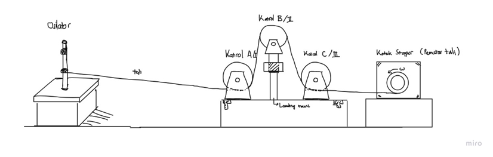
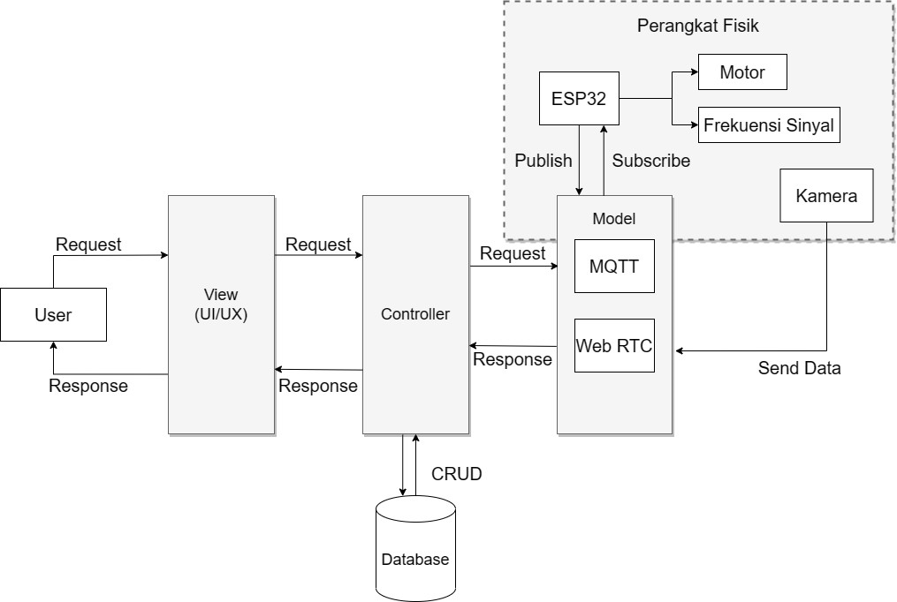
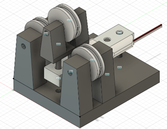
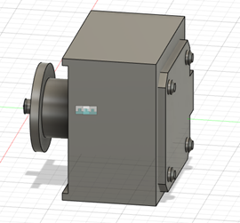

# Kit Praktikum IoT Gelombang Stasioner 
Repository ini ialah projek tugas besar mata kuliah IIoT yang membuat kit praktikum Gelombang Stasioner terintegrasi secara daring web-based menggunakan Node JS, Bootstrap, Websocket, MQTT, WebRTC, dan bcrypt.

Tugas besar ini dikerjakan oleh:
**Deedat Fatahillah / 13320072 (Project Manager/IoT and Backend)\n**
**Muhammad Imron Catur / 13320056 (Frontend)\n**
**Ramiza Bilhaq Mas Avicena / 13320007 (Mechanical Design)\n**
**Luqman Ardiseno / 13320021 (Mechanical Design)\n**
**Shabri Ash Shiddieqy / 13320075 (Electrical and Embedded Systems)\n**
**Nafidz Malik Farghana / 13319021 (Embedded Systems Programming)\n**
**Muhammad Lukmanul Hakim / 13319053 (Embedded Systems Programming)\n**

Desain sistem penggerak:

Arsitektur sistem IoT:

Desain sistem katrol:

Desain pemutar motor stepper:

